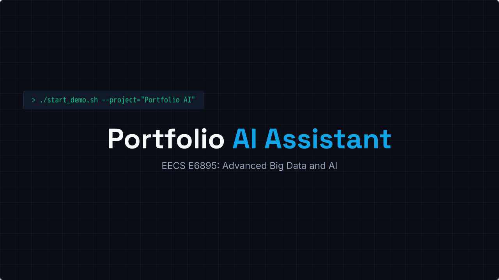
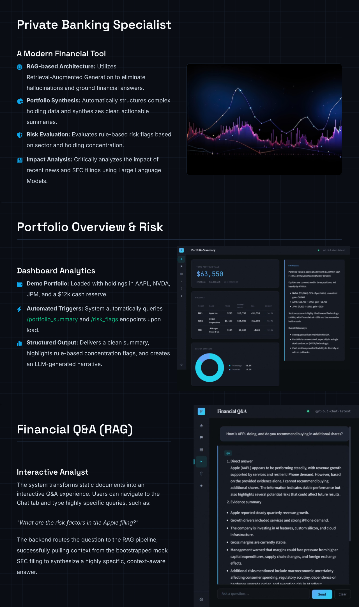

# Portfolio AI Assistant

**Languages:** English | [简体中文](docs/i18n/README.zh-CN.md)

[](https://hub.docker.com/r/ggdxwz/portfolio-ai) [](https://github.com/nyavana/portfolio_ai/actions/workflows/docker-publish.yml) [](https://www.python.org/downloads/release/python-3120/) [](https://deepwiki.com/nyavana/portfolio_ai)

A RAG-based financial portfolio assistant built with FastAPI, ChromaDB, and an OpenAI-compatible LLM. The frontend is a React app with a dark terminal-style UI.



The project is meant for portfolio analysis, risk review, and financial Q&A grounded in filings and news.

## Overview

At a high level, the app pairs a React frontend with a FastAPI backend, then uses ChromaDB to retrieve filings and news before sending context to an OpenAI-compatible LLM.

- Frontend: Dashboard, Risk Flags, News, Chat, Upload, and Status views
- Backend: portfolio summary, risk flag analysis, news impact analysis, uploads, and unified Q&A
- Retrieval: `chroma_news` for news and `chroma_filings` for SEC-style filing content
- Deployment options: Docker, local development, and SLURM-based HPC deployment

## Product Views



## Quick Start

If you just want to run it, Docker is the quickest way.

### Option 1: Build locally

```bash
docker build -t portfolio-ai .

docker run -p 8000:8000 \
  -e LMDEPLOY_API_KEY=sk-...your-key... \
  -e LMDEPLOY_BASE_URL=https://api.openai.com/v1 \
  -e LMDEPLOY_MODEL=gpt-5.3-chat-latest \
  portfolio-ai
```

### Option 2: Pull from Docker Hub

```bash
docker pull ggdxwz/portfolio-ai:latest

docker run -p 8000:8000 \
  -e LMDEPLOY_API_KEY=sk-...your-key... \
  -e LMDEPLOY_BASE_URL=https://api.openai.com/v1 \
  -e LMDEPLOY_MODEL=gpt-5.3-chat-latest \
  ggdxwz/portfolio-ai:latest
```

After the container starts, open:

- `http://localhost:8000` for the frontend UI
- `http://localhost:8000/docs` for the API docs

To persist ChromaDB data across container restarts, mount `DATA/`:

```bash
docker run -p 8000:8000 \
  -e LMDEPLOY_API_KEY=sk-... \
  -v $(pwd)/DATA:/app/DATA \
  portfolio-ai
```

For more Docker details, including Ollama on the host and published image tags, see [Docker Deployment](#docker-deployment).

## Prerequisites

### Docker quick start

- Docker
- An OpenAI API key or another OpenAI-compatible LLM endpoint

### Local development

- Python 3.12 (`/usr/bin/python3.12`)
- Node.js 18+ (tested on v25.8)
- An OpenAI API key or a local Ollama server

## Local Development Setup

Use this setup if you want the backend and frontend running separately during development.

### 1. Create the virtual environment

```bash
# python3.12-venv may not include ensurepip on Debian/Ubuntu;
# bootstrap pip manually if needed
python3.12 -m venv --without-pip .venv
curl -sS https://bootstrap.pypa.io/get-pip.py | .venv/bin/python3.12
```

If `ensurepip` is available:

```bash
python3.12 -m venv .venv
```

### 2. Install backend dependencies

```bash
.venv/bin/pip install -r requirements.txt
```

### 3. Configure environment variables

```bash
cp .env.example .env.local
# Edit .env.local and fill in LMDEPLOY_API_KEY
```

`.env.local` controls the runtime configuration:

| Variable | Default | Purpose |
|---|---|---|
| `LMDEPLOY_BASE_URL` | `https://api.openai.com/v1` | LLM API endpoint |
| `LMDEPLOY_MODEL` | `gpt-5.3-chat-latest` | Model name |
| `LMDEPLOY_API_KEY` | *(empty)* | API key — required for LLM calls |
| `HF_HOME` | `DATA/hf_home` | HuggingFace model cache |
| `TOKENIZERS_PARALLELISM` | `false` | Suppress tokenizer warnings |
| `PROJECT_DIR` | *(auto: repo root)* | Override data directory base |

### 4. Bootstrap the filings vector DB

`chroma_news` already has data. `chroma_filings` still needs to be bootstrapped from the mock files:

```bash
bash scripts/bootstrap_filings.sh
```

This indexes `DATA/uploads/filings/filing_apple_q_mock.txt` and `filing_nvidia_q_mock.txt`.
The `all-MiniLM-L6-v2` embedding model (~22 MB) is downloaded the first time and cached in `HF_HOME`.

### 5. Start the backend

```bash
bash run_api.sh
```

API docs are available at `http://127.0.0.1:8000/docs`.

### 6. Start the frontend

```bash
cd frontend
npm install
npm run dev
```

The frontend runs at `http://localhost:5173` and expects the backend on port `8000`.
You can override the API URL with `VITE_API_BASE_URL` in `frontend/.env.local`.

### Optional: use Ollama instead of a hosted API

```bash
ollama pull llama3.2:3b
# In .env.local:
# LMDEPLOY_BASE_URL=http://127.0.0.1:11434/v1
# LMDEPLOY_MODEL=llama3.2:3b
# LMDEPLOY_API_KEY=ollama
```

### OpenAI SDK compatibility

The project uses `openai==2.26.0`. For newer frontier models (GPT-5 class and above), two parameters differ from GPT-4:

| Parameter | Old (GPT-4) | New (GPT-5+) |
|---|---|---|
| Token limit | `max_tokens` | `max_completion_tokens` |
| Sampling | `temperature=0.2` | not supported — omit entirely |

`core/lmdeploy_client.py` already uses `max_completion_tokens` and leaves out `temperature`.
The HPC LLaMA deployment via LMDeploy is unaffected because it ignores unknown parameters.

## Verification

### Smoke test

```bash
# Health check
curl -s http://127.0.0.1:8000/health | python3 -m json.tool

# Full LLM round-trip — pass key as a request header (overrides env var)
curl -s -X POST http://127.0.0.1:8000/ask \
  -H "Content-Type: application/json" \
  -H "X-Api-Key: sk-...your-key..." \
  -d '{"question": "What are the risk factors in the Apple filing?"}' \
  | python3 -m json.tool

# Alternatively, set LMDEPLOY_API_KEY in .env.local and omit the header
```

## API Reference

See `docs/api/portfolio_ai_frontend_mock_api.md` for full request and response schemas, plus the matching TypeScript types.

### CORS

The backend allows cross-origin requests from `http://localhost:5173` and `http://127.0.0.1:5173`, configured in `app/api_server.py` through `CORSMiddleware`. If you deploy the frontend somewhere else, update `allow_origins`.

### Per-request LLM override headers

Every LLM-backed endpoint (`/portfolio_summary`, `/risk_flags`, `/news_impact`, `/ask`) can read three optional request headers and use them instead of the server-side environment variables:

| Header | Overrides | Example |
|---|---|---|
| `X-Api-Key` | `LMDEPLOY_API_KEY` | `sk-abc...` |
| `X-Api-Base-Url` | `LMDEPLOY_BASE_URL` | `https://api.openai.com/v1` |
| `X-Api-Model` | `LMDEPLOY_MODEL` | `gpt-4o` |

This is how the Settings modal in the UI passes the user's key without requiring a server restart. If a header is missing, the server-side default stays in effect.

### Endpoint quick reference

| Method | Path | Description |
|---|---|---|
| `GET` | `/api/status` | Service status and route list |
| `GET` | `/health` | LLM connectivity check |
| `GET` | `/config/llm` | Current LLM config (masked key hint) |
| `POST` | `/config/llm` | Replace server-side LLM config at runtime |
| `GET` | `/portfolio_summary` | Structured summary + LLM narrative |
| `GET` | `/risk_flags` | Rule-based flags + LLM explanation |
| `GET` | `/news_impact` | News matched to holdings + LLM summary |
| `POST` | `/ask` | Unified QA — routes to above or RAG (Financial Q&A) |
| `POST` | `/upload/filing` | Upload and index a filing document |
| `POST` | `/upload/news` | Upload and index a news document |

## Architecture

```text
┌─────────────────────────────────────────────────────────┐
│           React Frontend (Vite, port 5173)              │
│  Dashboard · Risk Flags · News · Chat · Upload · Status │
└────────────────────────┬────────────────────────────────┘
                         │ fetch (CORS enabled)
┌────────────────────────▼────────────────────────────────┐
│                   FastAPI (port 8000)                   │
│  GET /portfolio_summary  GET /risk_flags                │
│  GET /news_impact        POST /ask                      │
│  POST /upload/filing     POST /upload/news              │
└────────────────────────┬────────────────────────────────┘
                         │
           ┌─────────────┼─────────────┐
           ▼             ▼             ▼
     ChromaDB        ChromaDB      OpenAI-compatible
   (chroma_news)  (chroma_filings)   LLM API
   5 news docs     2 filing docs   gpt-5.3-chat-latest (local)
                                   LLaMA (HPC)
```

### Backend modules

| Path | Purpose |
|---|---|
| `app/api_server.py` | FastAPI routes + CORS middleware |
| `app/config.py` | Env-var driven config (no hard-coded paths) |
| `core/lmdeploy_client.py` | OpenAI-compatible LLM client |
| `core/router.py` | Query intent classification |
| `rag/filings_retriever.py` | ChromaDB retrieval for SEC filings |
| `rag/news_retriever.py` | ChromaDB retrieval for news |
| `services/` | Portfolio summary, risk flags, news impact, QA |
| `ingest/` | Chunking and indexing pipeline |
| `data/` | Data loading utilities |

### Frontend modules

| Path | Purpose |
|---|---|
| `frontend/src/api/` | Typed fetch wrappers for all 7 endpoints |
| `frontend/src/pages/` | Dashboard, RiskFlags, NewsImpact, Chat, Upload, Status |
| `frontend/src/components/` | Layout shell, AiCard, charts, common UI |
| `frontend/src/hooks/` | `useApi` (generic GET), `useChatHistory` (local chat state) |
| `frontend/src/styles/` | CSS design tokens, animations, global reset |
| `frontend/src/types/api.ts` | TypeScript interfaces mirroring backend contracts |

## Data Directory Structure

```text
DATA/
├── portfolio/
│   └── demo_portfolio.json        # 3 holdings: AAPL, NVDA, JPM + $12k cash
├── news/
│   └── demo_news.json             # 3 news items for AAPL, NVDA, JPM
├── filings/
│   └── financial_reports_sec_small_lite/   # HuggingFace dataset (optional)
├── uploads/
│   ├── filings/                   # Filing .txt files uploaded via API
│   └── news/                      # News .txt files uploaded via API
├── processed/
│   ├── filings/
│   └── news/
├── chroma_news/                   # ChromaDB: 5 docs (pre-populated)
├── chroma_filings/                # ChromaDB: 2 docs (bootstrapped)
└── hf_home/                       # HuggingFace model cache
```

## Docker Deployment

The repository includes a multi-stage `Dockerfile` that builds the React frontend and runs the FastAPI backend in one container. There is no separate web server. FastAPI serves the compiled frontend from `frontend/dist/`.

### Build the image

```bash
docker build -t portfolio-ai .
```

### Run the container

```bash
docker run -p 8000:8000 \
  -e LMDEPLOY_API_KEY=sk-...your-key... \
  -e LMDEPLOY_BASE_URL=https://api.openai.com/v1 \
  -e LMDEPLOY_MODEL=gpt-5.3-chat-latest \
  portfolio-ai
```

After that, the frontend is available at `http://localhost:8000` and the API docs are at `http://localhost:8000/docs`.

### How it works

| Stage | Base image | What it does |
|---|---|---|
| `frontend-builder` | `node:20-alpine` | `npm ci && npm run build` with `VITE_API_BASE_URL=""` |
| final | `python:3.12-slim` | installs Python deps, copies backend + `frontend/dist/`, starts uvicorn |

Setting `VITE_API_BASE_URL=""` at build time makes the React app call relative paths such as `/portfolio_summary` and `/api/status`, so the browser resolves them against the container's own port. That avoids CORS trouble.

> **Note:** `/api/status` is the canonical status endpoint in both development and Docker. The `/` path is reserved for the SPA shell when the compiled frontend is being served.

### Docker environment variables

Pass these with `-e` flags or a `.env` file such as `--env-file .env.local`:

| Variable | Description |
|---|---|
| `LMDEPLOY_API_KEY` | Required — your LLM API key |
| `LMDEPLOY_BASE_URL` | LLM endpoint (default: OpenAI) |
| `LMDEPLOY_MODEL` | Model name |

### Using Ollama inside Docker

```bash
docker run -p 8000:8000 \
  -e LMDEPLOY_BASE_URL=http://host.docker.internal:11434/v1 \
  -e LMDEPLOY_MODEL=llama3.2:3b \
  -e LMDEPLOY_API_KEY=ollama \
  portfolio-ai
```

### Data persistence

ChromaDB databases live inside the container at `/app/DATA/`. If you want them to survive restarts, mount a volume:

```bash
docker run -p 8000:8000 \
  -e LMDEPLOY_API_KEY=sk-... \
  -v $(pwd)/DATA:/app/DATA \
  portfolio-ai
```

### Pull from Docker Hub

A pre-built image is published automatically on every push to `main` through GitHub Actions. You do not need to clone the repo or build it yourself on a remote server:

```bash
docker pull ggdxwz/portfolio-ai:latest

docker run -p 8000:8000 \
  -e LMDEPLOY_API_KEY=sk-...your-key... \
  -e LMDEPLOY_BASE_URL=https://api.openai.com/v1 \
  -e LMDEPLOY_MODEL=gpt-5.3-chat-latest \
  ggdxwz/portfolio-ai:latest
```

With persistent data volume:

```bash
docker run -p 8000:8000 \
  -e LMDEPLOY_API_KEY=sk-... \
  -v $(pwd)/DATA:/app/DATA \
  ggdxwz/portfolio-ai:latest
```

Each push to `main` also creates a pinned tag based on the Git commit SHA, for example `ggdxwz/portfolio-ai:abc1234`, if you want a reproducible deployment target.

## HPC Deployment (SLURM)

Use `api_server.sbatch` for GPU cluster deployment. The script exports the required environment variables (`PROJECT_DIR`, `LMDEPLOY_*`) and overrides the local defaults in `app/config.py`. You should not need to modify the sbatch file.

```bash
sbatch api_server.sbatch
```

The sbatch script does five things:

1. Sets up conda env (`lmdeploy_env`)
2. Starts LMDeploy inference server on port `23333`
3. Waits for LMDeploy to be ready for up to 15 minutes
4. Starts FastAPI on port `8000`
5. Keeps the job alive until the API process exits

You can reach it from your local machine through an SSH tunnel:

```bash
ssh -L 8000:localhost:8000 <hpc-host>
```

## ChromaDB Notes

The `chroma_news` SQLite database was created with an older version of chromadb. If you upgrade and hit `KeyError: '_type'`, patch the `config_json_str` column:

```python
import chromadb
from chromadb.api.configuration import CollectionConfigurationInternal

cfg = CollectionConfigurationInternal().to_json_str()
# Then: UPDATE collections SET config_json_str = '<cfg>' WHERE name = 'news';
```

The project is pinned to `chromadb==0.6.3`. The existing SQLite schema (migration level 10) does not work with the chromadb 1.x rewrite.
